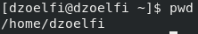
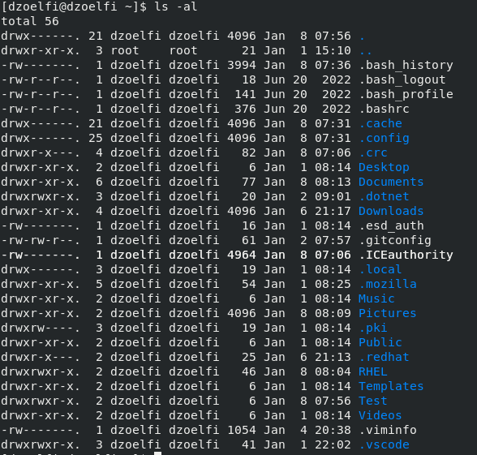
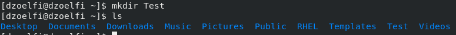
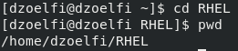
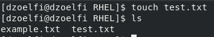
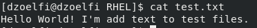
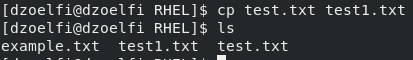
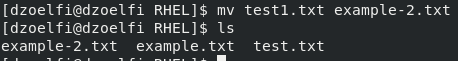
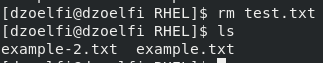

# Basic Files and Directories Commands

## 1. `pwd` - Print Working Directory
   - **Command:** `pwd`
   - **Explanation:** Prints the full path of the current working directory. Useful for determining the current location in the file system.
   

## 2. `ls` - List Directory Contents
   - **Command:** `ls`
   - **Explanation:** Lists the files and directories in the current directory. Commonly used options include:
     - `-l`: Long format, providing detailed information about each file or directory.
     - `-a`: Displays hidden files (those starting with a dot).
   

## 3. `mkdir` - Make Directory
   - **Command:** `mkdir [directory_name]`
   - **Explanation:** Creates a new directory with the specified name in the current working directory.
   

## 4. `cd` - Change Directory
   - **Command:** `cd [directory_path]`
   - **Explanation:** Changes the current working directory to the specified path. Commonly used options include:
     - `cd`: Change to the home directory.
     - `cd ..`: Move up one directory level.
     - `cd -`: Switch to the previous working directory.
   

## 5. `touch` - Create Empty File or Update File Timestamp
   - **Command:** `touch [file_name]`
   - **Explanation:** Creates an empty file with the specified name. If the file already exists, it updates the file's access and modification timestamps.
   

## 6. `echo` - Display Message or Output
   - **Command:** `echo [message]`
   - **Explanation:** Prints the specified message or text to the terminal. It is also used in shell scripts to display text.
   

## 7. `cat` - Concatenate and Display File Content
   - **Command:** `cat [file_name]`
   - **Explanation:** Displays the contents of the specified file on the terminal. It can also be used to concatenate and display multiple files.
   

## 8. `cp` - Copy Files or Directories
   - **Command:** `cp [source] [destination]`
   - **Explanation:** Copies files or directories from the source to the destination. Use the `-r` option to copy directories recursively.
   

## 9. `mv` - Move or Rename Files or Directories
   - **Command:** `mv [source] [destination]`
   - **Explanation:** Moves files or directories from the source to the destination. It can also be used to rename files or directories.
   

## 10. `rm` - Remove Files or Directories
   - **Command:** `rm [file_name]` or `rm -r [directory_name]`
   - **Explanation:** Removes files or directories. Use `rm -r` to remove directories recursively.
   
