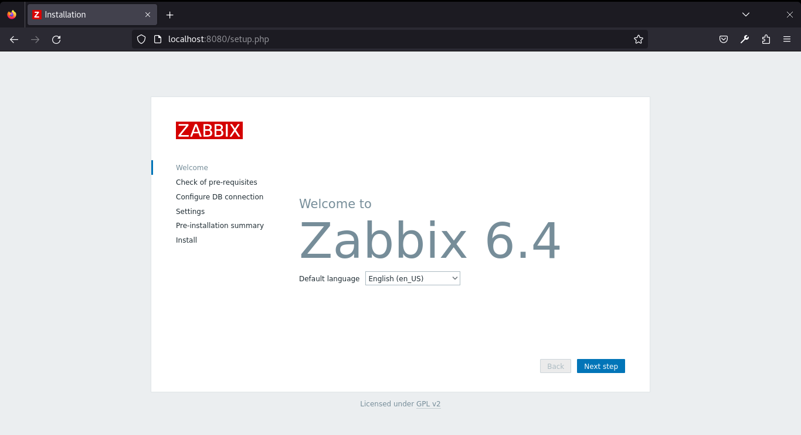
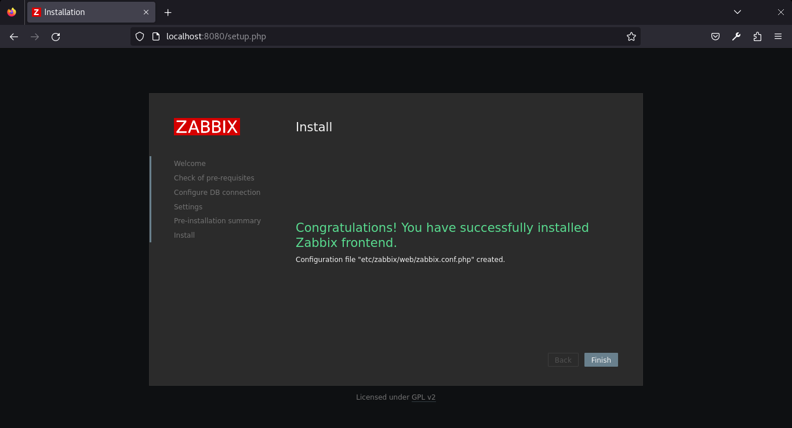
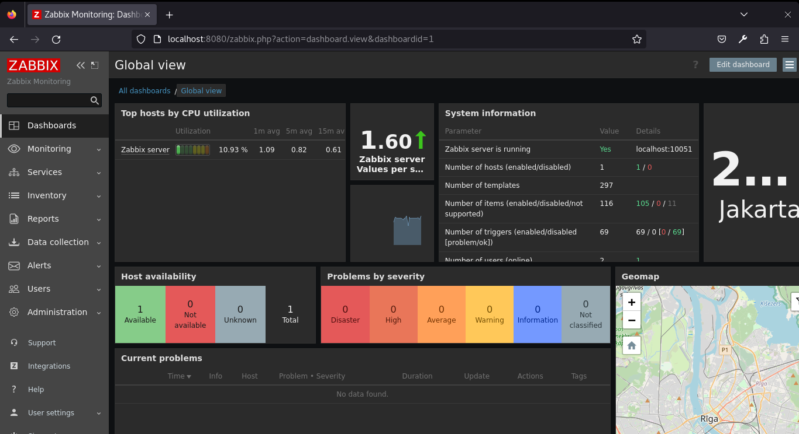

# Install Zabbix Monitoring System on Red Hat Enterprise Linux (RHEL) with PostgreSQL and Nginx

`Zabbix` is an open-source monitoring solution that provides real-time monitoring of servers, virtual machines, and network devices. This guide outlines the steps to install `Zabbix` on a Red Hat Enterprise Linux system using `PostgreSQL` as the database and `Nginx` as the web server.

## 1. Install `Zabbix` repository:
- **Steps:**
    ```
    sudo rpm -Uvh https://repo.zabbix.com/zabbix/6.4/rhel/8/x86_64/zabbix-release-6.4-1.el8.noarch.rpm
    sudo dnf clean all 
    ```
    
- **Explanation:** Add Zabbix repository to your system.

## 2. Switch `DNF` module version for `PHP`:
- **Steps:**
    ```
    sudo dnf module switch-to php:7.4
    ```
    
- **Explanation:** Switch DNF module version for PHP.

## 3. Install `Zabbix` server, `frontend`, `agent`:
- **Steps:**
    ```
    sudo dnf install zabbix-server-pgsql zabbix-web-pgsql zabbix-nginx-conf zabbix-sql-scripts zabbix-selinux-policy zabbix-agent 
    ```
    
- **Explanation:** Isntall Zabbix server, frontend, and agent to your system.

## 4. Create new `user` and `database`:
- **Steps:**
    ```
    sudo -u postgres createuser --pwprompt zabbix
    sudo -u postgres createdb -O zabbix zabbix
    ```
    
- **Explanation:** Create new user and database `Zabbix` on PostgreSQL.

## 5. Import initial `schema` and `data`:
- **Steps:**
    ```
    zcat /usr/share/zabbix-sql-scripts/postgresql/server.sql.gz | sudo -u zabbix psql zabbix
    ```
    

- **Explanation:** Import initial schema and data on PostgreSQL

## 6. Configure the `database` for `Zabbix` server:
- **Steps:** Edit file /etc/zabbix/zabbix_server.conf
    ```
    sudo nano /etc/zabbix/zabbix_server.conf 
    ```
    
    
- **Explanation:** Configure the database by edit Zabbix server configuration file.

## 7. Configure `PHP` for `Zabbix frontend`:
- **Steps:** Edit file /etc/nginx/conf.d/zabbix.conf uncomment and set 'listen' and 'server_name' directives.
    ```
    sudo nano /etc/nginx/conf.d/zabbix.conf
    ```
    
- **Explanation:** Configure PHP for Zabbix frontend by edit Nginx web server configuration.

## 8. Start `Zabbix` server and `agent` processes :
- **Steps:**
    ```
    systemctl restart zabbix-server zabbix-agent nginx php-fpm
    systemctl enable zabbix-server zabbix-agent nginx php-fpm
    ```
    

- **Explanation:** Start Zabbix server and agent.
    

## 8. Open `Zabbix UI` web page on `browser`:
- **Steps:** Open link `http://localhost:<port>`
    ```
    http://localhost:8080
    ```
    
- **Explanation:** Access Zabbix UI on web browser.

- **Complete `Zabbix` setup**
    
    
    
    
    

- **Login to `Zabbix UI` on `browser`**
    
    
    

## Conclusion
Zabbix is now installed and configured on your Red Hat Enterprise Linux system using PostgreSQL as the database and Nginx as the web server. You can start adding hosts, configuring monitoring, and utilizing the powerful features of Zabbix for effective system monitoring.