# Install PostgreSQL Database Server on Red Hat Enterprise Linux

PostgreSQL is a powerful, open-source relational database management system (RDBMS) known for its reliability, extensibility, and SQL compliance. This guide outlines the steps to install PostgreSQL on Red Hat Enterprise Linux (RHEL).

## 1. Update System Packages:
- **Steps:**
    ```
    sudo dnf update
    ```
    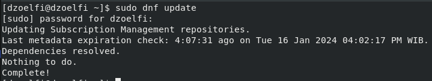
- **Explanation:** Ensure your system has the latest package information.

## 2. Add PostgreSQL RPM Repository:
- **Steps:**
    ```
    sudo dnf install -y https://download.postgresql.org/pub/repos/yum/reporpms/EL-8-x86_64/pgdg-redhat-repo-latest.noarch.rpm
    ```
    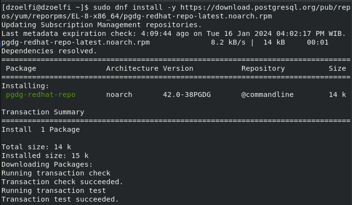
- **Explanation:** Add the PostgreSQL repository to your package manager for installation.

## 3. Disable the built-in PostgreSQL module:
- **Steps:**
    ```
    sudo dnf -qy module disable postgresql
    ```
    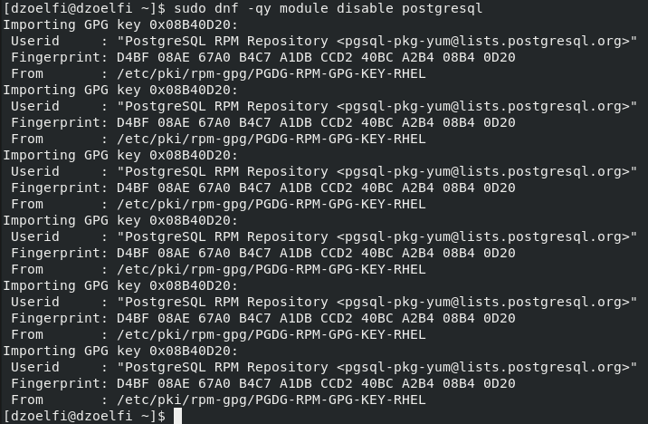
- **Explanation:** Disable the built-in PostgreSQL module to prevent conflicts.

## 4. Install PostgreSQL:
- **Steps:**
    ```
    sudo dnf install -y postgresql16-server
    ```
    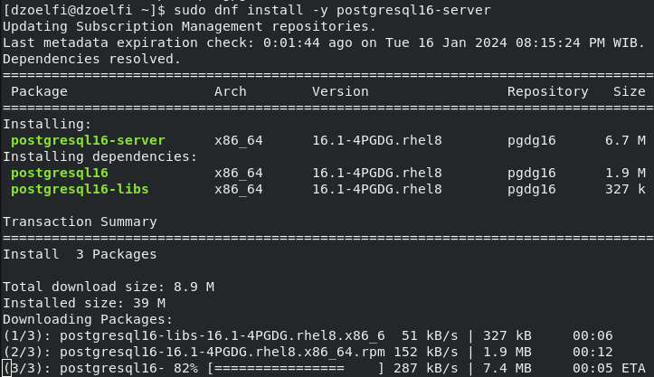
- **Explanation:** Install the PostgreSQL server package on your system.

## 5. Optionally initialize the database and enable automatic start:
- **Steps:**
    ```
    sudo /usr/pgsql-16/bin/postgresql-16-setup initdb
    ```
    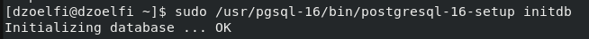

    ```
    sudo systemctl enable postgresql-16
    sudo systemctl start postgresql-16
    ```
    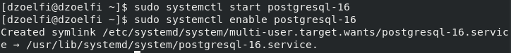
- **Explanation:** Initialize the PostgreSQL database and enable automatic startup.

## 6. Check status of PostgreSQL:
- **Steps:**
    ```
    sudo systemctl status postgresql-16
    ```
    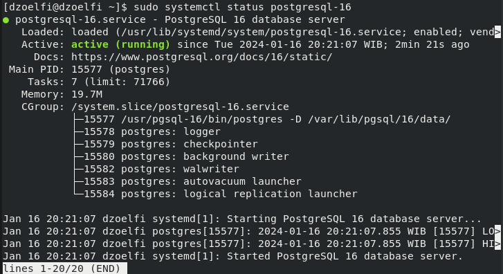
- **Explanation:** Verify the status of the PostgreSQL service to ensure it's running.

## 7. Try Access the Database using CLI:
- **Steps:**
    ```
    sudo -u postgres psql
    ```
    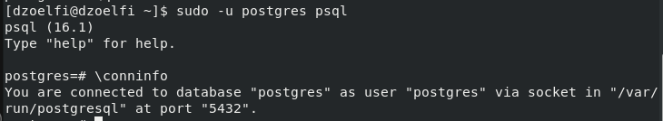
- **Explanation:** Try to access PostgreSQL shell using CLI.

## 8. Custom configuration:
- **Steps:**
    ```
    postgres=# CREATE USER mydbuser WITH PASSWORD 'mypasswd' CREATEROLE CREATEDB;
    ```
    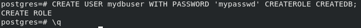

- **Explanation:** Create a custom user with specific roles and permissions.
    
- **Login to new `user`:**
    ```
    psql -U mydbuser -h 127.0.0.1 -d postgres
    ```
    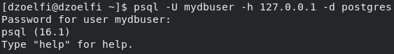

- **Create new database for `mydbuser`:**
    ```
    postgres=> CREATE DATABASE mydatabase;
    ```
    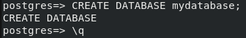

- **Connect to `mydatabase` with `mydabuser`**
    ```
    psql -U mydbuser -h 127.0.0.1 -d mydatabase
    ```
    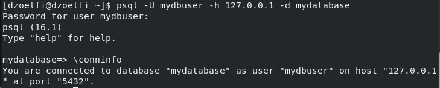
## 8. Install PostgreSQL database management tool:
- **Steps: Add `pgAdmin` repository**
    ```
    sudo rpm -i https://ftp.postgresql.org/pub/pgadmin/pgadmin4/yum/pgadmin4-redhat-repo-2-1.noarch.rpm
    ```
    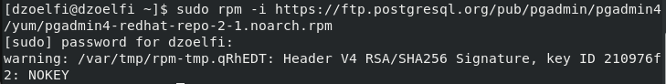

- **Install `pgAdmin` Web mode**
    ```
    sudo dnf install pgadmin4-web
    ```
    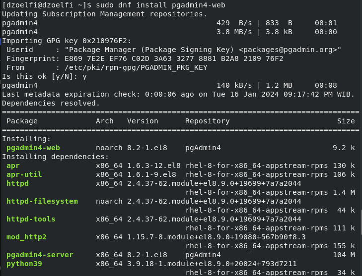

- **Configure `pgAdmin`**
    ```
    sudo /usr/pgadmin4/bin/setup-web.sh
    ```
    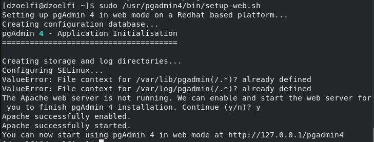

- **Access `pgAdmin` on `browser`**
    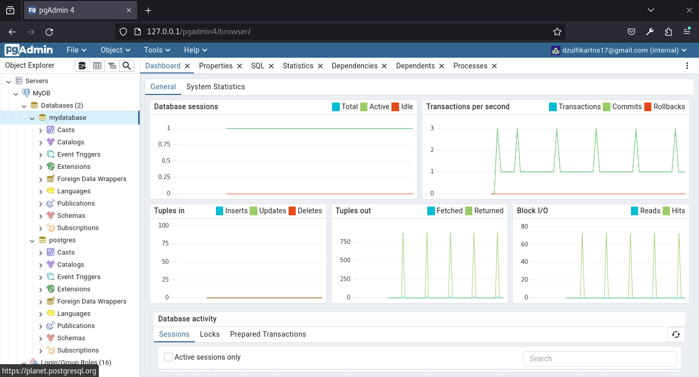

## Conclusion
PostgreSQL is now installed and configured on your Red Hat Enterprise Linux system. You can begin using and managing databases with the PostgreSQL server.

Feel free to explore advanced PostgreSQL features, such as roles, permissions, and database optimization, based on your specific use case.