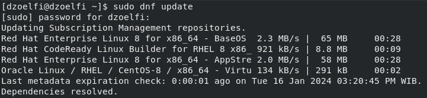
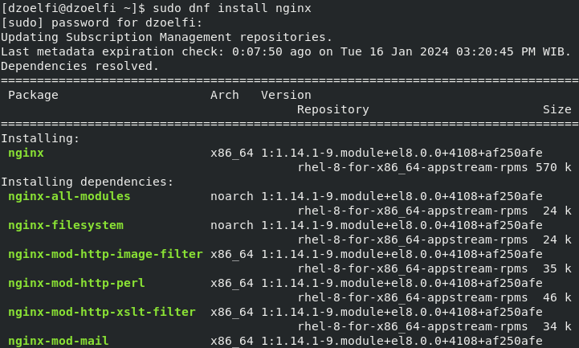
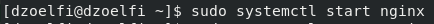
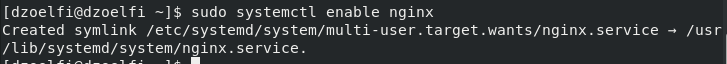
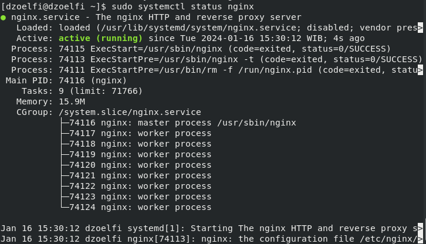
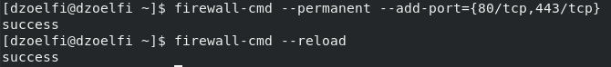
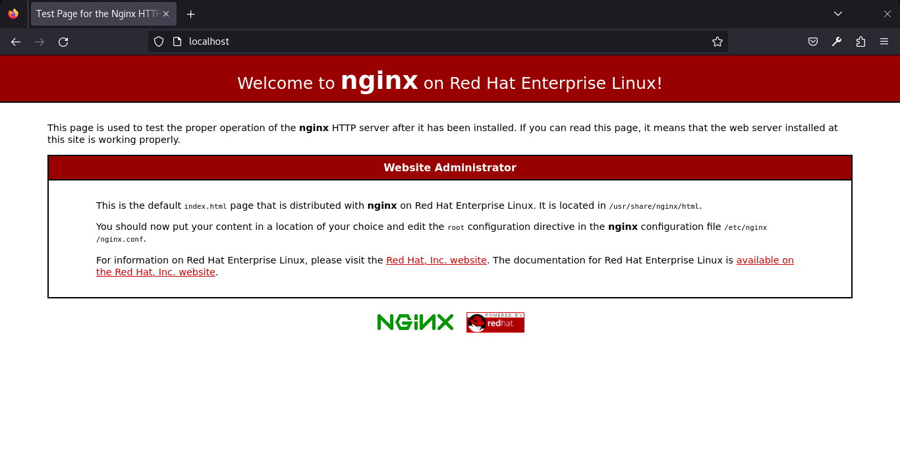
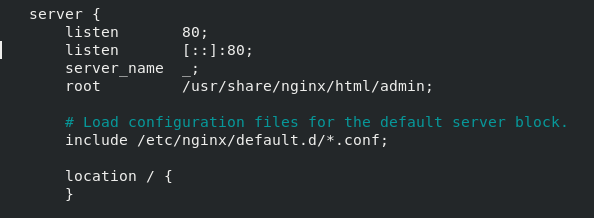
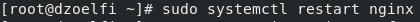

# Install Web Server on Red Hat Enterprise Linux

Nginx, a versatile and high-performance web server, is widely chosen for its efficiency in handling concurrent connections and low resource utilization. Installing Nginx on Red Hat Enterprise Linux (RHEL) is a pivotal step towards establishing a reliable web hosting environment.

## 1. Update System Packages:
- **Steps:**
    ```
    sudo dnf update
    ```
    
- **Explanation:** Ensure your system has the latest package information.

## 2. Install Nginx Web Server Package:
- **Steps:**
    ```
    sudo dnf install nginx
    ```
    
- **Explanation:** Use DNF package manager to install the web server package.

## 3. Start Web Server Service:
- **Steps:**
    ```
    sudo systemctl start nginx
    ```
    
- **Explanation:** Start the web server service.

## 4. Enable Web Server to Start on Boot:
- **Steps:**
    ```
    sudo systemctl enable nginx
    ```
    
- **Explanation:** Configure the web server to start automatically on system boot.

## 5. Check Web Server Status:
- **Steps:**
    ```
    sudo systemctl status nginx
    ```
    
- **Explanation:** Verify the status of the web server service to ensure it's running.

## 6. Open Firewall for Web Server (if firewall is enabled):
- **Steps:**
    ```
    sudo firewall-cmd --add-port={80/tcp,443/tcp} --permanent
    sudo firewall-cmd --reload
    ```
    
- **Explanation:** Allow the appropriate service (e.g., http for Apache, http for Nginx) through the firewall to access the web server.

## 7. Access the Default Web Page:
- **Steps:**
    ```
    http://localhost:80
    ```
    
- **Explanation:** Open a web browser and navigate to the specified address to confirm the successful installation.

## 8. Custom configuration:
- **Steps:**
    ```
    nano /etc/nginx/nginx.conf
    ```
    

- **Explanation:** Edit configuration file for the port and where the root files (index.html)
    
- **Restart web service:**
    ```
    sudo systemctl restart nginx
    ```
    

- **Reload the web broswer:**
    
- **Explanation:** Custom web interface successfully displayed