# Network Configuration on Red Hat Enterprise Linux

Configuring and managing the network is a fundamental aspect of maintaining a Red Hat Enterprise Linux (RHEL) system. A robust network configuration ensures seamless communication between servers, facilitates secure data transfer, and forms the backbone of various network services.

Throughout this tutorial, we will employ a dual approach, combining traditional terminal-based commands with the convenience of Cockpit, a user-friendly web-based interface.

Let's embark on a journey to master network configuration on RHEL, equipping you with the skills needed to build, optimize, and troubleshoot a resilient network infrastructure.

## 1. Viewing Network Configuration
   - **Objective:** Understand the current network configuration.
   - **Steps:**
     - Use commands such as `ifconfig` or `ip addr` to view network interfaces.
    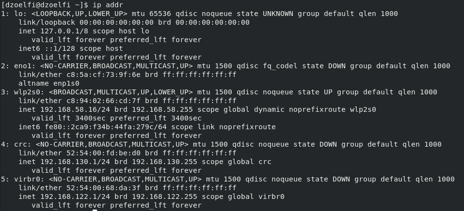
     - Review network interface on `Cockpit`.
    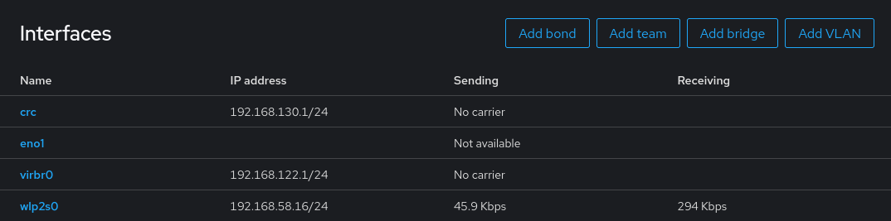

## 2. Configuring Network Interfaces
   - **Objective:** Set up or modify network interfaces.
   - **Steps:**
     - Use `nmtui` (NetworkManager Text User Interface) or `Cockpit` to configure the network.
    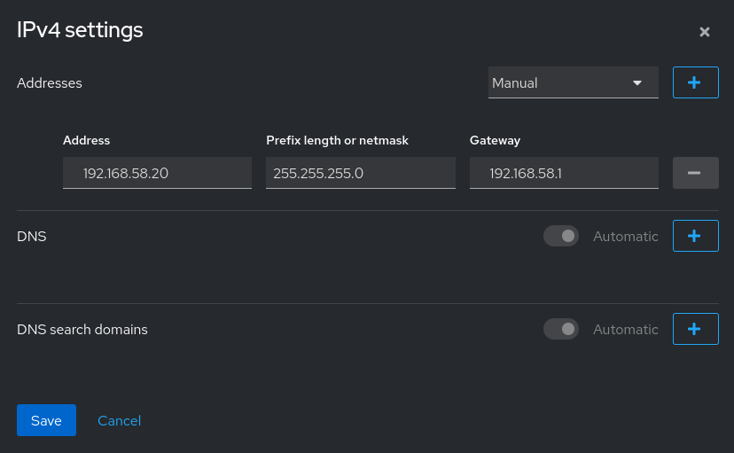

## 3. Setting Hostname and Domain
   - **Objective:** Configure the system's hostname and domain.
   - **Steps:**
     - Use `hostnamectl` to set and view the system's hostname.
    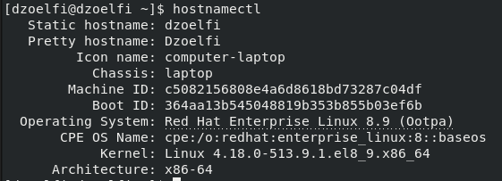

## 4. DNS Configuration
   - **Objective:** Set up DNS (Domain Name System) resolution.
   - **Steps:**
     - View `/etc/resolv.conf` to view DNS servers configuration.

        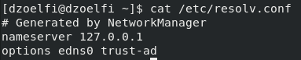

## 5. Network Routes and Default Gateway
   - **Objective:** Define network routes and set the default gateway.
   - **Steps:**
     - Use `ip route` or `route` commands to display and modify routes.
    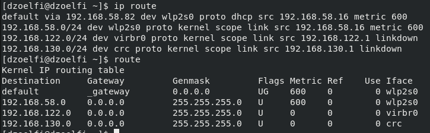

## 6. Network Bonding
   - **Objective:** Configure network bonding for link aggregation.
   - **Steps:**
     - Use `Cockpit` to configure network bonding options and modes.
    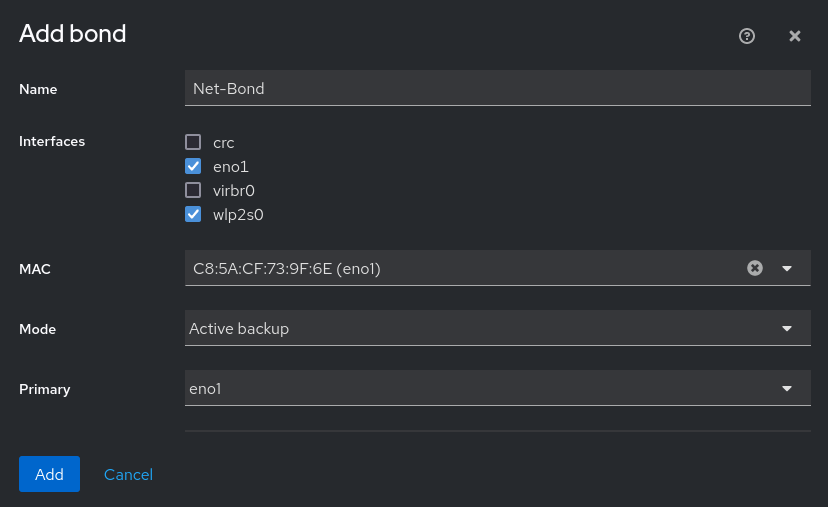

## 7. Network Teaming
   - **Objective:** Set up network teaming for fault tolerance and load balancing.
   - **Steps:**
     - Use `Cockpit` to configure network teaming options and modes.
    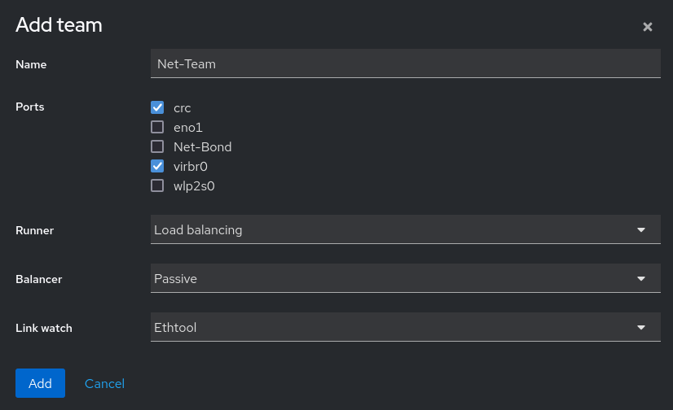

## 8. Network VLAN
   - **Objective:** Used to segment and isolate traffic for organizational or security purposes.
   - **Steps:**
     - Use `Cockpit` to configure network VLAN.
    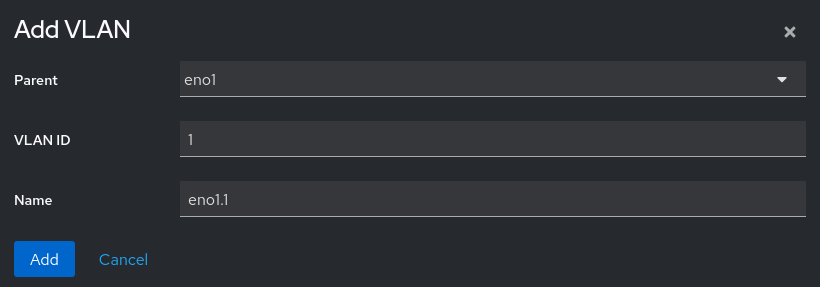

## 9. Network Troubleshooting Tools
   - **Objective:** Learn tools for diagnosing and troubleshooting network issues.
   - **Steps:**
     - Use commands like `ping`, `traceroute`, and `netstat` for diagnostics.
    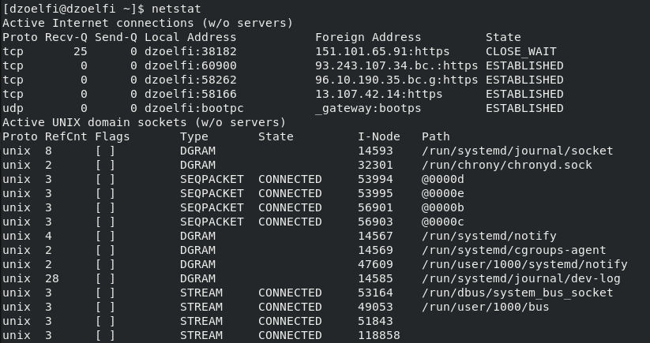
    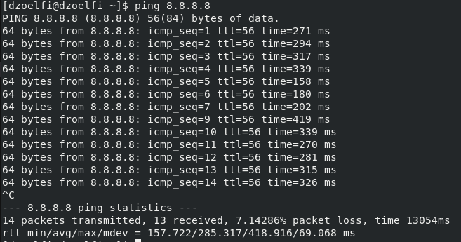
     - Analyze network logs on `Cockpit`.
    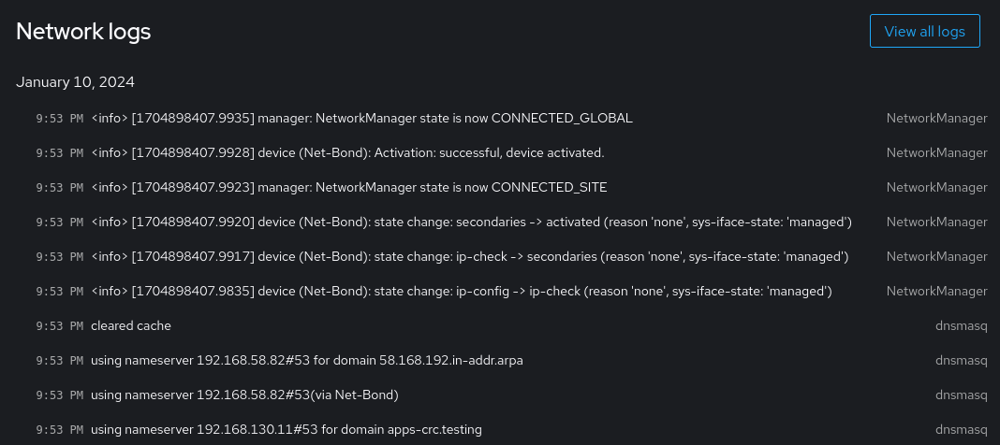