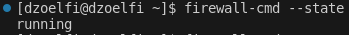
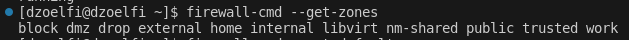
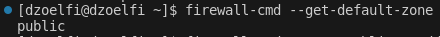
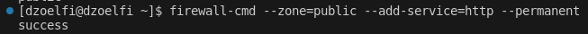
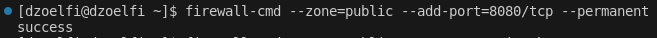
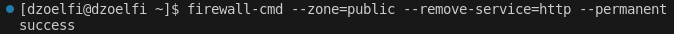
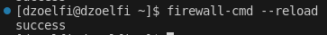

# Firewall Basic Configuration

Understanding the fundamentals of firewalls is crucial for maintaining a secure and controlled network environment. Firewalls act as a barrier between a trusted internal network and untrusted external networks, regulating incoming and outgoing traffic based on predefined security rules.

In this section, we will delve into essential concepts and commands to configure and manage firewalls on Red Hat-based systems. Whether you are securing a single server or managing a complex network infrastructure, mastering these basics will empower you to enhance the security posture of your systems.

## 1. Check the current firewall status:
- **Steps:**
    ```
    firewall-cmd --state
    ```
    
- **Explanation:** Verify whether the firewall is currently running.

## 2. List available firewall zones:
- **Steps:**
    ```
    firewall-cmd --get-zones
    ```
    
- **Explanation:** Display the available firewall zones.

## 3. Show the default firewall zone:
- **Steps:**
    ```
    firewall-cmd --get-default-zone
    ```
    
- **Explanation:** Identify the default firewall zone.

## 4. Add a service to a specific zone (e.g., HTTP to the public zone):
- **Steps:**
    ```
    firewall-cmd --zone=public --add-service=http --permanent
    ```
    
- **Explanation:** Allow HTTP traffic in the public zone.

## 5. Open a specific port (e.g., 8080) for TCP traffic in a zone:
- **Steps:**
    ```
    firewall-cmd --zone=public --add-port=8080/tcp --permanent
    ```
    
- **Explanation:** Allow incoming TCP traffic on port 8080 in the public zone.

## 6. Remove a service (e.g., HTTP) from a zone:
- **Steps:**
    ```
    firewall-cmd --zone=public --remove-service=http --permanent
    ```
    
- **Explanation:** Revoke the allowance for HTTP traffic in the public zone.

## 7. Reload the firewall configuration to apply changes:
- **Steps:**
    ```
    firewall-cmd --reload
    ```
    
- **Explanation:** Apply changes made to the firewall configuration.

**Additional Tips:**
- Always use the `--permanent` option when making changes to ensure persistence after reboot
- Regularly review and update firewall rules based on security requirements.
- Explore Cockpit for a graphical representation of firewall settings.
